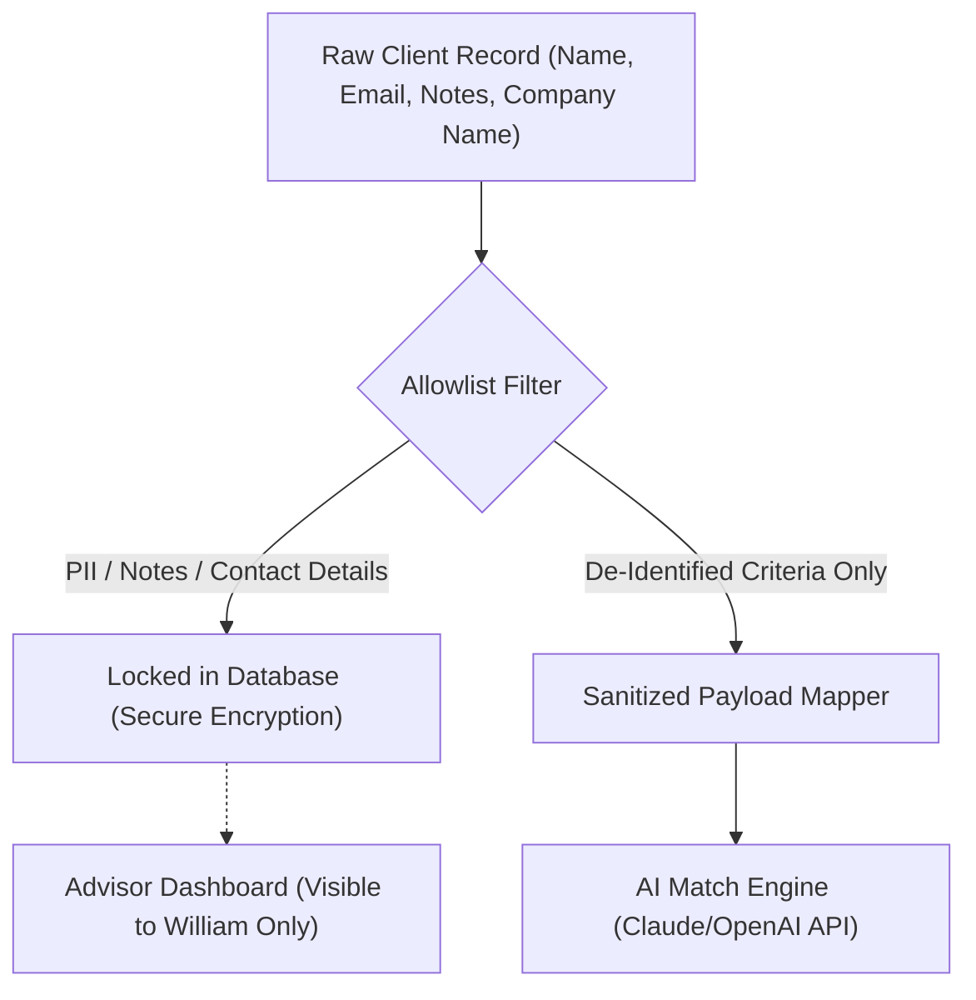

# WAMA Platform Ready: Security, Data Privacy & AI Safeguards

This briefing has been prepared to outline the readiness of the WAMA platform and address all privacy and data residency questions regarding sensitive client records and deal information.

With the latest updates, **the WAMA platform is fully configured and ready for production use.** William can begin inputting actual buyer profiles, seller mandates, and tracking active matches.

---

## 1. System Readiness: Key Features Enabled
* **Deal Readiness Tracker:** A pipeline progression checklist directly tracking target milestones:
  * Discovery Meeting $\rightarrow$ NDA Signed $\rightarrow$ Documents Received $\rightarrow$ Preliminary Analysis $\rightarrow$ Mandate Proposal Sent $\rightarrow$ Mandate Signed $\rightarrow$ Marketing Docs Ready.
* **Document Checklist & Score:** Standard CPA-signed financials (last 5 years), interim current-year statements, A/R & A/P lists, employee org charts, and salary detail indicators are tracked to compile exit preparedness.
* **Confidential Deal Parameters:** Projected Deal Value ($) and Target Close Dates can be logged and edited dynamically on each matchup.
* **M&A Specific Capital Criteria:** Expansion of buyer budget metrics to support Down Payment amounts, Source of Funds, Min EBITDA requirements, Min Employees, Min Operational Years, Client Concentration tolerances, and specific M&A financing structures (e.g., Vendor Take-Back / Balance of Sale, Mezzanine debt, Equity partners).

---

## 2. Reassurance: How Client Information is Safeguarded

William’s boutique M&A client records are protected by multiple, overlapping layers of technical security and architecture guardrails:

### Data Storage Security (Convex Database)
> [!IMPORTANT]
> All client records are stored in a private, high-performance database instance hosted by Convex. 
> * **Encryption at Rest:** All tables are encrypted using AES-256.
> * **Encryption in Transit:** All traffic is encrypted using TLS 1.3, preventing interception.
> * **Advisor Role Restrictions:** Access to the administration panel is restricted strictly to authorized user sessions verified by **Clerk Enterprise Authentication**. Buyers and Sellers cannot see each other's details or browse directories.

---

## 3. Strict AI Privacy Guardrails (Claude Prompt Sandboxing)

When WAMA executes AI-assisted matching, **no Personally Identifiable Information (PII) is ever exposed.** 

The system implements a **Strict Allowlist Data Mapper** that intercepts data before it is processed.

### De-Identification Protocols
* **Pseudonymized References:** Before transmitting data to the AI model, the system strips the seller's business name and the buyer's real name. They are replaced by randomized 6-character hexadecimal codes (e.g., `Projet Boulangerie` $\rightarrow$ `Confidential Project Ref: b7d3d0`).
* **Content Sandboxing:**
  * **Direct Details & Notes:** Phone numbers, emails, and William's confidential deal notes **never** leave the database.
  * **Allowed Prompt Fields:** The matching engine is only sent de-identified criteria (e.g., target industry, revenue brackets, employee count, geographic region, and the advisor-written, de-identified sale description).
* **Enterprise API Policies:** WAMA accesses LLM models (Anthropic Claude / OpenAI GPT) through enterprise API endpoints. Under these service agreements, **zero data is retained** by the providers, and **no user data is ever used to train public LLM models.**

---

## 4. Summary Table: Data Access Matrix

| Client Data Field | Visible to William | Visible to AI Matching Engine | Visible to Portal Users (Buyers/Sellers) |
| :--- | :---: | :---: | :---: |
| **Owner Names / Contacts** | Yes | **No (Strips PII)** | **No** |
| **Internal Business Name** | Yes | **No (Strips PII)** | **No (Displays "Confidential Project")** |
| **Advisor Confidential Remarks**| Yes | **No** | **No** |
| **Financial Ranges (Rev/EBITDA)**| Yes | Yes | Yes (Range brackets only) |
| **Checklist Completion Status** | Yes | Yes (Calculates Fit Strength) | Yes (Only own dashboard) |
| **Projected Deal Value / Close Date**| Yes | **No** | **No** |

William can rest assured that he is operating a **fully private, secure advisory workspace** where client confidentiality is protected at both the database level and the AI processing boundary.
